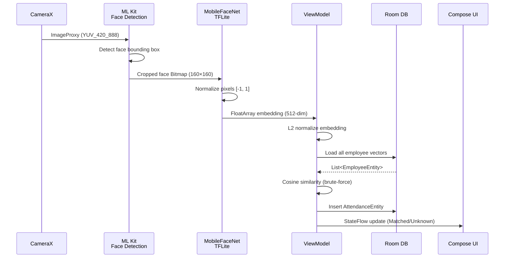

# 🏗️ ChamCong – Facial Recognition Time Attendance Architecture

## Project Structure

```
app/src/main/
├── AndroidManifest.xml
├── assets/
│   └── mobilefacenet.tflite          ← YOU MUST PLACE YOUR MODEL HERE
│
├── java/com/bienhieu/chamcong/
│   ├── TimeKeepingApp.kt               ← Application class (singletons)
│   │
│   ├── camera/
│   │   └── FaceAnalyzer.kt          ← CameraX + ML Kit face detection
│   │
│   ├── data/local/
│   │   ├── EmployeeEntity.kt        ← Room entity (faceVectors nullable List<FloatArray>)
│   │   ├── AttendanceEntity.kt      ← Room entity (check-in/out log)
│   │   ├── EmployeeDao.kt           ← DAO for employee CRUD
│   │   ├── AttendanceDao.kt         ← DAO for attendance records
│   │   ├── VectorTypeConverter.kt   ← FloatArray ↔ JSON converter
│   │   └── TimeKeepingDatabase.kt      ← Room database singleton (version 6)
│   │
│   ├── ml/
│   │   ├── FaceEmbeddingHelper.kt   ← TFLite MobileFaceNet inference
│   │   ├── FaceMatcher.kt           ← Brute-force nearest neighbor search
│   │   └── VectorMath.kt            ← Cosine similarity & Euclidean distance
│   │
│   └── ui/
│       ├── MainActivity.kt          ← Single-activity entry point
│       ├── AttendanceScreen.kt      ← Main Compose UI (camera + status)
│       ├── AttendanceViewModel.kt   ← Orchestrates the attendance pipeline
│       └── theme/
│           └── Theme.kt             ← Dark kiosk theme
│
└── res/
    └── values/
        ├── strings.xml
        └── themes.xml
```

## Data Flow Pipeline



## Threading Model

| Operation | Dispatcher | Reason |
|-----------|-----------|--------|
| Camera frame capture | CameraX executor | Dedicated single-thread |
| ML Kit face detection | ML Kit internal | Task-based async |
| TFLite inference | `Dispatchers.Default` | CPU-bound computation |
| Vector comparison | `Dispatchers.Default` | CPU-bound math |
| Room database I/O | `Dispatchers.IO` | Disk-bound |
| UI state updates | `Main` | Compose recomposition |

## Vector Matching Math

### Cosine Similarity (Primary)

```
                A · B              Σ(aᵢ × bᵢ)
cos(θ) = ─────────────── = ─────────────────────────
           ‖A‖ × ‖B‖       √Σ(aᵢ²) × √Σ(bᵢ²)
```

- **Range**: `[-1.0, 1.0]`
- **Threshold**: `0.60` (configurable in `FaceMatcher.kt`)
- **Interpretation**: `1.0` = identical, `0.0` = unrelated

### Euclidean Distance (Alternative)

```
d(A, B) = √ Σ(aᵢ - bᵢ)²
```

- **Range**: `[0, +∞)`
- **Interpretation**: Lower = more similar

## Before You Run

> [!IMPORTANT]
> You MUST place a `mobilefacenet.tflite` model file in `app/src/main/assets/` before building.
> 
> Download options:
> - [MobileFaceNet (192-dim)](https://github.com/sirius-ai/MobileFaceNets) – Standard variant
> - [InsightFace MobileFaceNet](https://github.com/deepinsight/insightface) – High accuracy
> 
> After downloading, verify the model's input/output dimensions and update `FaceEmbeddingHelper.kt`:
> - `INPUT_SIZE` (typically 112)
> - `EMBEDDING_DIM` (128, 192, or 512 depending on variant)

## Threshold Tuning Guide

| Threshold | False Accept Rate | False Reject Rate | Recommended For |
|-----------|------------------|-------------------|-----------------|
| 0.50 | High | Low | Testing/development |
| **0.60** | **Moderate** | **Low** | **Indoor kiosk (default)** |
| 0.70 | Low | Moderate | High-security areas |
| 0.85 | Very Low | High | Not recommended (too strict) |

> [!TIP]
> Start with `0.60` and test with your actual employees and lighting conditions.
> Adjust `FaceMatcher.SIMILARITY_THRESHOLD` based on real-world accuracy.

## Next Steps

1. **Add Employee Registration UI** – A screen to capture face + enter name
2. **Add Attendance History Screen** – View today's log with employee names and timestamps
3. **Kiosk Mode Lock** – Use Android Device Owner API to lock the device to this app
4. **Multi-face Enrollment** – Capture 3-5 images per employee for better accuracy
5. **Anti-spoofing** – Add liveness detection (blink, head turn) using ML Kit classification
